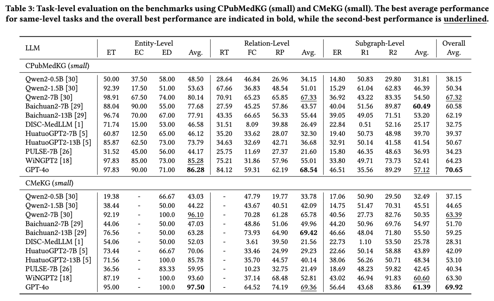
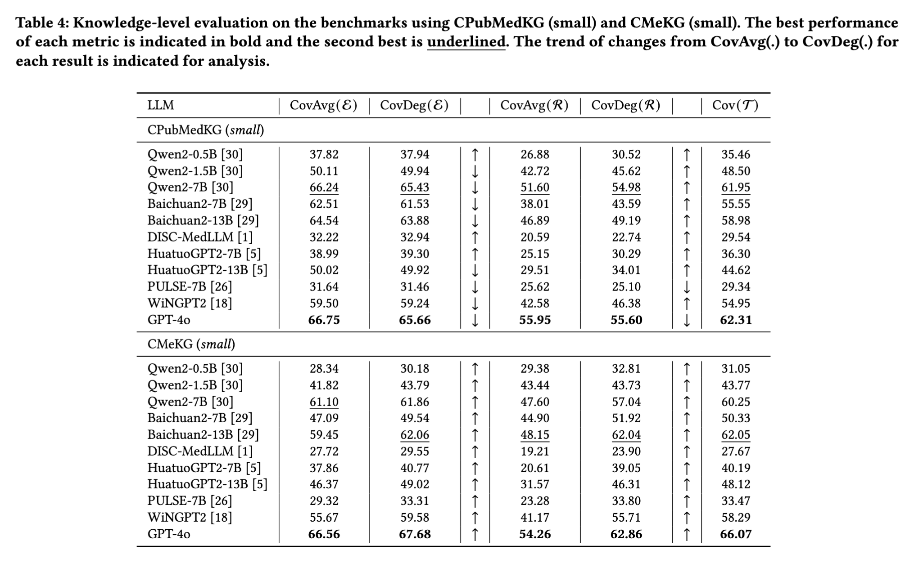

# MedKGEval

This repository contains the code and benchmarks for the paper _**How Much Medical Knowledge Do LLMs Have? An Evaluation of Medical Knowledge Coverage for LLMs**_, presented at the Proceedings of WWW 2025 (Web4Good Track) as a poster.

## Overview

**MedKGEval** is designed to evaluate the medical knowledge coverage of large language models (LLMs) using established medical knowledge graphs (KGs). This repository provides the necessary tools and datasets to facilitate comprehensive evaluations of LLMs in the medical domain. The overview of **MedKGEval** is shown in the follwing figure.


## Medical Knowledge Graphs

In MedKGEval, we utilize **CPubMedKG** and **CMeKG** as baseline knowledge graphs due to their open-source nature and widespread adoption in the Chinese medical field. The source data for these KGs can be found in the following directories:

- **CPubMedKG**: `kg_data/CPubMedKG`
- **CMeKG**: `kg_data/CMeKG`

The downsampling strategy employed for these medical KGs, as detailed in Section 4.1 of the paper, is implemented in the script located at `utils/kg_sample.py`.

## Evaluation Benchmarks

We employ the scripts in `utils/qa_construct.py` to construct various evaluation tasks, including entity-level, relation-level, and subgraph-level tasks, as described in Section 3.2 of the paper.

We have open-sourced the evaluation benchmarks for both **CPubMedKG** and **CMeKG**, which have been downsampled into large and small scales. You can find these benchmarks in the following directories:

- **CPubMedKG** (large/small): `benchmarks/CPubMedKG_large`, `benchmarks/CPubMedKG_small`
- **CMeKG** (large/small): `benchmarks/CMeKG_large`, `benchmarks/CMeKG_small`

## Evaluating LLMs

### LLM Description and Statistics

The following table summarizes the large language models evaluated in this study, including their parameter counts, domains, and repository/API versions:

| LLM               | #Params | Domain         | Base          | Repository / API Version               |
|-------------------|---------|----------------|---------------|----------------------------------------|
| Qwen2-0.5B        | 0.5B    | General-domain | -              | Qwen/Qwen2-0.5B-Instruct              |
| Qwen2-1.5B        | 1.5B    | General-domain | -              | Qwen/Qwen2-1.5B-Instruct              |
| Qwen2-7B          | 7B      | General-domain | -              | Qwen/Qwen2-7B-Instruct                |
| Baichuan2-7B      | 7B      | General-domain | -              | baichuan-inc/Baichuan2-7B-Chat        |
| Baichuan2-13B     | 13B     | General-domain | -              | baichuan-inc/Baichuan2-13B-Chat       |
| DISC-MedLLM       | 13B     | Medical-domain | Baichuan-13B   | Flmc/DISC-MedLLM                      |
| HuatuoGPT2-7B     | 7B      | Medical-domain | Baichuan2-7B   | FreedomIntelligence/HuatuoGPT2-7B     |
| HuatuoGPT2-13B    | 13B     | Medical-domain | Baichuan2-13B  | FreedomIntelligence/HuatuoGPT2-13B    |
| PULSE-7B          | 7B      | Medical-domain | Bloom-7B       | OpenMEDLab/PULSE-7bv5                 |
| WiNGPT2           | 8B      | Medical-domain | Llama-3-8B     | winninghealth/WiNGPT2-Llama-3-8B-Chat |
| GPT-4o            | -       | General-domain | -              | 2024-10-01-preview                    |

### Running LLMs with MedKGEval Benchmarks

To evaluate the LLMs using the **MedKGEval** benchmarks, you can utilize the scripts located in `scripts/run_*.py`. Below is an example bash script for evaluating `qwen2-7b` on the `CMeKG_small` dataset:

```bash
# List of evaluated LLMs
llm_list=("qwen2-7b")
# List of Medical KG scale
scale_list=("small")
# List of evaluated tasks
data_list=("CMeKG_entity_level_task_ET" "CMeKG_entity_level_task_EC" "CMeKG_entity_level_task_ED" "CMeKG_relation_level_task_RT" "CMeKG_relation_level_task_FC" "CMeKG_relation_level_task_RP" "CMeKG_subgraph_level_task_ER" "CMeKG_subgraph_level_task_R1" "CMeKG_subgraph_level_task_R2")
# Run the evaluation scripts
for llm in ${llm_list[@]}; do
    for scale in ${scale_list[@]}; do
        for data in ${data_list[@]}; do
            CUDA_VISIBLE_DEVICES=0,1 python3 run_qwen.py --model ${llm} --input data/CMeKG_${scale}/${data}.json --output output/CMeKG_${scale}/${data}_${llm}.json
        done
    done
done
```

You can follow the above script to reproduce our experimental results.

## Evaluation Results

We have open-sourced the responses of several LLMs using the MedKGEval framework. For the `CMeKG_small` dataset, the responses from five selected LLMs (Qwen2-0.5B/1.5B/7B and HuatuoGPT2-7B/13B) can be found in the directory `results/CMeKG_small/`.
Both task-oriented and knowledge-oriented evaluation metrics are computed using the script located at `utils/eval.py`.

The experimental results for task-oriented evaluation on `CPubMedKG_small` and `CMedKG_small` are presented below.



The experimental results for knowledge-oriented evaluation on `CPubMedKG_small` and `CMedKG_small` are presented below.



## Citation

If you find this repository or the benchmarks useful in your research, please cite our paper as follows:

```
```

## License

This project is licensed under the MIT License. See the [LICENSE](LICENSE) file for details.
