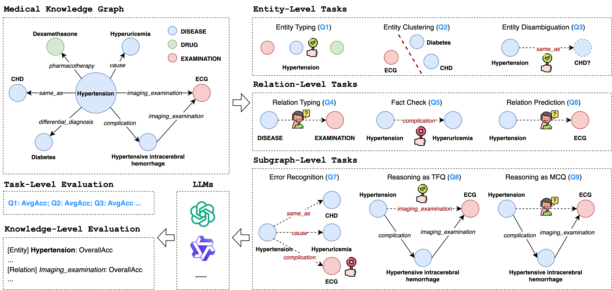

# MedKGEval

This repository contains the code and benchmarks for the paper _**How Much Medical Knowledge Do LLMs Have? An Evaluation of Medical Knowledge Coverage for LLMs**_, presented at the Proceedings of WWW 2025 (Web4Good Track).

## Updates

* ${\color{red}[\text{2025-04-22 New}]}$  We add evaluation results of HuatuoGPT-o1-7B in the following [section](#evaluation-results).
* [2025-03-27]  We add evaluation results of DeepSeek-R1-Distill-Qwen-1.5B/7B/14B in the following [section](#evaluation-results).
* [2025-03-17] We add evaluation results of Tencent-Hunyuan-Large in the following [section](#evaluation-results).
* [2025-02-27] We spot minor bug in `utils/qa_construct.py` and reproduce the results of subgraph-level R1 task. The task-oriented and knowledge-oriented evaluation is therefore updated in the following [section](#evaluation-results).
* [2025-02-18] We add evaluation results of DeepSeek-V3 in the following [section](#evaluation-results).

## Overview

**MedKGEval** is designed to evaluate the medical knowledge coverage of large language models (LLMs) using established medical knowledge graphs (KGs). This repository provides the necessary tools and datasets to facilitate comprehensive evaluations of LLMs in the medical domain. The overview of **MedKGEval** is shown in the follwing figure.



## Medical Knowledge Graphs

In MedKGEval, we utilize **CPubMedKG** and **CMeKG** as baseline knowledge graphs due to their open-source nature and widespread adoption in the Chinese medical field. The source data for these KGs can be found in the following directories:

- **CPubMedKG**: `kg_data/CPubMedKG`
- **CMeKG**: `kg_data/CMeKG`

The downsampling strategy employed for these medical KGs, as detailed in Section 4.1 of the paper, is implemented in the script located at `utils/kg_sample.py`.

You can retrieve the KG data via this [Google Drive link](https://drive.google.com/file/d/1nRrhOWlvzdOgpatpQxJP0jiZrnRxhN8v/view?usp=sharing).

## Evaluation Benchmarks

We employ the scripts in `utils/qa_construct.py` to construct various evaluation tasks, including entity-level, relation-level, and subgraph-level tasks, as described in Section 3.2 of the paper.

We have open-sourced the evaluation benchmarks for both **CPubMedKG** and **CMeKG**, which have been downsampled into large and small scales. You can find these benchmarks in the following directories:

- **CPubMedKG** (large/small): `benchmarks/CPubMedKG_large`, `benchmarks/CPubMedKG_small`
- **CMeKG** (large/small): `benchmarks/CMeKG_large`, `benchmarks/CMeKG_small`

You can retrieve the benchmarks via this [Google Drive link](https://drive.google.com/file/d/1lRj3BZ31Yad5sWCt1Lk6d1-uwAczWPJZ/view?usp=sharing).

## Evaluating LLMs

### LLM Description and Statistics

The following table summarizes the large language models evaluated in this study, including their parameter counts, domains, and repository/API versions:

| LLM                   | #Params Arch | Domain           | Reasoning | Base   | Repository / API Version               |
|-----------------------|--------------|------------------|-----------|--------|----------------------------------------|
| [G] Qwen2-0.5B        | 0.5B Dense   | [G]eneral-domain | NO  | -            | [Qwen/Qwen2-0.5B-Instruct](https://huggingface.co/Qwen/Qwen2-0.5B-Instruct) |
| [G] Qwen2-1.5B        | 1.5B Dense   | [G]eneral-domain | NO  | -            | [Qwen/Qwen2-1.5B-Instruct](https://huggingface.co/Qwen/Qwen2-1.5B-Instruct) |
| [G] Qwen2-7B          | 7B Dense     | [G]eneral-domain | NO  | -            | [Qwen/Qwen2-7B-Instruct](https://huggingface.co/Qwen/Qwen2-7B-Instruct)     |
| [G] Baichuan2-7B      | 7B Dense     | [G]eneral-domain | NO  | -            | [baichuan-inc/Baichuan2-7B-Chat](https://huggingface.co/baichuan-inc/Baichuan2-7B-Chat)  |
| [G] Baichuan2-13B     | 13B Dense    | [G]eneral-domain | NO  | -            | [baichuan-inc/Baichuan2-13B-Chat](https://huggingface.co/baichuan-inc/Baichuan2-7B-Chat) |
| [G] DeepSeek-R1-1.5B  | 1.5B Dense   | [G]eneral-domain | YES | Qwen2.5-Math-1.5B | [deepseek-ai/DeepSeek-R1-Distill-Qwen-1.5B](https://huggingface.co/deepseek-ai/DeepSeek-R1-Distill-Qwen-1.5B) |
| [G] DeepSeek-R1-7B    | 7B Dense     | [G]eneral-domain | YES | Qwen2.5-Math-7B   | [deepseek-ai/DeepSeek-R1-Distill-Qwen-7B](https://huggingface.co/deepseek-ai/DeepSeek-R1-Distill-Qwen-7B) |
| [G] DeepSeek-R1-14B   | 14B Dense    | [G]eneral-domain | YES | Qwen2.5-14B       | [deepseek-ai/DeepSeek-R1-Distill-Qwen-14B](https://huggingface.co/deepseek-ai/DeepSeek-R1-Distill-Qwen-14B) |
| [M] DISC-MedLLM       | 13B Dense    | [M]edical-domain | NO  | Baichuan-13B      | [Flmc/DISC-MedLLM](https://huggingface.co/Flmc/DISC-MedLLM) |
| [M] HuatuoGPT2-7B     | 7B Dense     | [M]edical-domain | NO  | Baichuan2-7B      | [FreedomIntelligence/HuatuoGPT2-7B](https://huggingface.co/FreedomIntelligence/HuatuoGPT2-7B)   |
| [M] HuatuoGPT2-13B    | 13B Dense    | [M]edical-domain | NO  | Baichuan2-13B     | [FreedomIntelligence/HuatuoGPT2-13B](https://huggingface.co/FreedomIntelligence/HuatuoGPT2-13B) |
| [M] PULSE-7B          | 7B Dense     | [M]edical-domain | NO  | Bloom-7B          | [OpenMEDLab/PULSE-7bv5](https://huggingface.co/OpenMEDLab/PULSE-7bv5) |
| [M] WiNGPT2           | 8B Dense     | [M]edical-domain | NO  | Llama-3-8B        | [winninghealth/WiNGPT2-Llama-3-8B-Chat](https://huggingface.co/winninghealth/WiNGPT2-Llama-3-8B-Chat) |
| [M] HuatuoGPT-o1-7B   | 7B Dense     | [M]edical-domain | YES | Qwen2.5-7B        | [FreedomIntelligence/HuatuoGPT-o1-7B](https://huggingface.co/FreedomIntelligence/HuatuoGPT-o1-7B) |
| [G] GPT-4o            | -            | [G]eneral-domain | NO  | -                 | ```2024-10-01-preview``` |
| [G] DeepSeek-V3       | 37B Act / 671B MoE | [G]eneral-domain | NO  | -           | [deepseek-ai/DeepSeek-V3](https://huggingface.co/deepseek-ai/DeepSeek-V3) |
| [G] Hunyuan-Large     | 52B Act / 389B MoE | [G]eneral-domain | NO  | -           | ```hunyuan-large-2025-02-10``` |

### Running LLMs with MedKGEval Benchmarks

To evaluate the LLMs using the **MedKGEval** benchmarks, you can utilize the scripts located in `scripts/run_*.py`. Below is an example bash script for evaluating `qwen2-7b` on the `CMeKG_small` dataset:

```bash
# List of evaluated LLMs
llm_list=("qwen2-7b")
# List of Medical KG scale
scale_list=("small")
# List of evaluated tasks
data_list=("CMeKG_entity_level_task_ET" "CMeKG_entity_level_task_EC" "CMeKG_entity_level_task_ED" "CMeKG_relation_level_task_RT" "CMeKG_relation_level_task_FC" "CMeKG_relation_level_task_RP" "CMeKG_subgraph_level_task_ER" "CMeKG_subgraph_level_task_R1" "CMeKG_subgraph_level_task_R2")
# Run the evaluation scripts
for llm in ${llm_list[@]}; do
    for scale in ${scale_list[@]}; do
        for data in ${data_list[@]}; do
            CUDA_VISIBLE_DEVICES=0,1 python3 run_qwen.py --model ${llm} --input data/CMeKG_${scale}/${data}.json --output output/CMeKG_${scale}/${data}_${llm}.json
        done
    done
done
```

You can follow the above script to reproduce our experimental results.

## Evaluation Results

We have open-sourced the responses of several LLMs using the MedKGEval framework. For the `CMeKG_small` dataset, the responses from five selected LLMs (Qwen2-0.5B/1.5B/7B and HuatuoGPT2-7B/13B) can be found in the directory `results/CMeKG_small/`.
Both task-oriented and knowledge-oriented evaluation metrics are computed using the script located at `utils/eval.py`.

You can retrieve some of the evaluation results via this [Google Drive link](https://drive.google.com/file/d/1b6lF6DrjDtecXw7niWlcZlUxcgTykC7d/view?usp=sharing).

The evaluation results with MedKGEval (`CPubMedKG_small`/`CPubMedKG_large`) and with MedKGEval (`CMeKG_small`/`CMeKG_large`) are presented in the [doc](./docs/evaluation.md).

### Evaluation with MedKGEval (`CPubMedKG_small`)

The experimental results for task-oriented evaluation on `CPubMedKG_small` are presented below.

| LLM | ET | EC | ED | Avg. | RT | FC | RP | Avg. | ER | R1 | R2 | Avg. | Overall |
|-----|---:|---:|---:|-----:|---:|---:|---:|-----:|---:|---:|---:|-----:|--------:|
| [G] Qwen2-0.5B       | 50.00 | 37.50 | 58.00 | 48.50 | 28.64 | 46.84 | 26.96 | 34.15 | 14.80 | 54.17 | 29.80 | 32.92 | 38.52 |
| [G] Qwen2-1.5B       | 92.39 | 17.50 | 51.00 | 53.63 | 67.66 | 36.83 | 48.54 | 51.01 | 15.29 | 64.31 | 62.83 | 47.48 | 50.71 |
| [G] Qwen2-7B         | 98.91 | 67.50 | 74.00 | 80.14 | 70.91 | 65.23 | 65.85 | 67.33 | 36.92 | 56.72 | 83.35 | 59.00 | 68.82 |
| [G] Baichuan2-7B     | 88.04 | 90.00 | 55.00 | 77.68 | 27.59 | 45.25 | 57.86 | 43.57 | 40.04 | 70.06 | 89.87 | 66.66 | 62.63 |
| [G] Baichuan2-13B    | 96.74 | 70.00 | 67.00 | 77.91 | 43.35 | 66.65 | 56.33 | 55.44 | 39.05 | 69.52 | 71.51 | 60.03 | 64.46 |
| [G] DeepSeek-R1-1.5B | 81.52 | 65.00 | 64.00 | 70.17 | 46.63 | 46.61 | 43.09 | 45.44 | 37.70 | 60.76 | 62.55 | 53.67 | 56.43 |
| [G] DeepSeek-R1-7B   | 96.74 | 87.50 | 60.00 | 81.41 | 73.93 | 57.78 | 57.00 | 62.90 | 43.40 | 52.66 | 83.10 | 59.72 | 68.01 |
| [G] DeepSeek-R1-14B  | 98.91 | 100.0 | 63.00 | 87.30 | 83.64 | 59.38 | 60.69 | 67.90 | 54.09 | 47.68 | 89.96 | 63.91 | 73.04 |
| [M] DISC-MedLLM      | 71.74 | 15.00 | 53.00 | 46.58 | 31.51 | 8.09  | 39.88 | 26.49 | 22.84 | 00.21 | 52.16 | 25.07 | 32.71 |
| [M] HuatuoGPT2-7B    | 60.87 | 12.50 | 65.00 | 46.12 | 35.20 | 33.62 | 28.07 | 32.30 | 19.40 | 52.31 | 48.98 | 40.23 | 39.55 |
| [M] HuatuoGPT2-13B   | 85.87 | 62.50 | 73.00 | 73.79 | 34.63 | 32.69 | 42.71 | 36.68 | 32.91 | 55.44 | 41.58 | 43.31 | 51.26 |
| [M] PULSE-7B         | 31.52 | 45.00 | 56.00 | 44.17 | 25.75 | 11.69 | 27.37 | 21.60 | 15.80 | 31.30 | 48.63 | 31.91 | 32.56 |
| [M] WiNGPT2          | 97.83 | 85.00 | 73.00 | 85.28 | 75.21 | 31.86 | 57.96 | 55.01 | 33.80 | 68.50 | 73.73 | 58.68 | 66.32 |
| [M] HuatuoGPT-o1-7B  | 96.74 | 97.50 | 56.00 | 83.41 | 71.51 | 33.00 | 56.40 | 53.64 | 46.53 | 31.50 | 76.97 | 51.67 | 62.91 |
| [G] GPT-4o           | 97.83 | 90.00 | 71.00 | 86.28 | 84.12 | 59.31 | 62.19 | 68.54 | 46.51 | 41.50 | 89.29 | 59.10 | 71.31 |
| [G] DeepSeek-V3      | 97.83 | 87.50 | 71.00 | 85.44 | 78.35 | 58.48 | 60.95 | 65.93 | 42.82 | 45.72 | 87.10 | 58.55 | 69.97 |
| [G] Hunyuan-Large    | 96.74 | 100.0 | 72.00 | 89.58 | 60.38 | 49.90 | 58.24 | 56.17 | 47.36 | 58.45 | 85.45 | 63.75 | 69.84 |

The experimental results for knowledge-oriented evaluation on `CPubMedKG_small` are presented below.

| LLM | CovAvg($\mathcal{E}$) | CovDeg($\mathcal{E}$) | CovAvg($\mathcal{R}$) | CovDeg($\mathcal{R}$) | Cov($\mathcal{T}$) |
|-----|----------------------:|----------------------:|----------------------:|----------------------:|-------------------:|
| [G] Qwen2-0.5B       | 38.36 | 38.34 | 28.65 | 33.11 | 36.60 |
| [G] Qwen2-1.5B       | 51.93 | 51.39 | 46.15 | 47.44 | 50.08 |
| [G] Qwen2-7B         | 69.99 | 68.99 | 58.72 | 61.79 | 66.59 |
| [G] Baichuan2-7B     | 66.08 | 65.20 | 45.28 | 51.28 | 60.56 |
| [G] Baichuan2-13B    | 68.23 | 67.47 | 55.79 | 57.17 | 64.04 |
| [G] DeepSeek-R1-1.5B | 55.97 | 55.76 | 46.63 | 47.02 | 52.85 |
| [G] DeepSeek-R1-7B   | 67.27 | 66.42 | 59.01 | 58.70 | 63.85 |
| [G] DeepSeek-R1-14B  | 70.48 | 68.89 | 63.08 | 61.53 | 66.44 |
| [M] DISC-MedLLM      | 32.22 | 32.90 | 20.34 | 22.72 | 29.51 |
| [M] HuatuoGPT2-7B    | 38.74 | 39.01 | 26.28 | 33.02 | 37.01 |
| [M] HuatuoGPT2-13B   | 50.66 | 50.28 | 32.22 | 37.08 | 45.88 |
| [M] PULSE-7B         | 31.24 | 29.89 | 25.67 | 24.65 | 28.15 |
| [M] WiNGPT2          | 63.17 | 62.60 | 49.30 | 53.88 | 59.70 |
| [M] HuatuoGPT-o1-7B  | 60.44 | 59.36 | 50.81 | 49.88 | 56.20 |
| [G] GPT-4o           | 69.39 | 67.69 | 61.27 | 60.69 | 65.36 |
| [G] DeepSeek-V3      | 68.93 | 67.26 | 59.38 | 59.66 | 64.73 |
| [G] Hunyuan-Large    | 69.94 | 68.75 | 60.97 | 57.28 | 64.93 |

### Evaluation with MedKGEval (`CMeKG_small`)

The experimental results for task-oriented evaluation on `CMeKG_small` are presented below.

| LLM | ET | EC | ED | Avg. | RT | FC | RP | Avg. | ER | R1 | R2 | Avg. | Overall |
|-----|---:|---:|---:|-----:|---:|---:|---:|-----:|---:|---:|---:|-----:|--------:|
| [G] Qwen2-0.5B       | 19.38 | - | 66.67 | 43.03 | - | 47.79 | 19.77 | 33.78 | 17.06 | 54.14 | 29.50 | 33.57 | 37.85 |
| [G] Qwen2-1.5B       | 38.44 | - | 50.00 | 44.22 | - | 43.67 | 40.51 | 42.09 | 14.75 | 58.33 | 70.31 | 47.80 | 46.00 |
| [G] Qwen2-7B         | 92.19 | - | 100.0 | 96.10 | - | 70.28 | 61.28 | 65.78 | 40.56 | 67.62 | 82.76 | 63.65 | 70.09 |
| [G] Baichuan2-7B     | 44.06 | - | 50.00 | 47.03 | - | 48.86 | 51.06 | 49.96 | 44.20 | 71.76 | 69.76 | 61.91 | 55.82 |
| [G] Baichuan2-13B    | 76.56 | - | 50.00 | 63.28 | - | 73.93 | 64.90 | 69.42 | 46.66 | 79.87 | 71.80 | 66.11 | 64.83 |
| [G] DeepSeek-R1-1.5B | 48.13 | - | 50.00 | 49.07 | - | 47.17 | 34.99 | 41.08 | 31.80 | 64.36 | 57.93 | 51.36 | 47.35 |
| [G] DeepSeek-R1-7B   | 62.19 | - | 50.00 | 56.10 | - | 63.10 | 40.17 | 51.64 | 39.69 | 67.03 | 66.50 | 57.74 | 54.70 |
| [G] DeepSeek-R1-14B  | 91.87 | - | 66.67 | 79.27 | - | 62.46 | 72.17 | 67.32 | 53.39 | 53.16 | 76.83 | 61.13 | 64.94 |
| [M] DISC-MedLLM      | 54.06 | - | 50.00 | 52.03 | - | 3.61  | 39.50 | 21.56 | 22.73 | 00.71 | 53.50 | 25.65 | 28.21 |
| [M] HuatuoGPT2-7B    | 73.44 | - | 66.67 | 70.06 | - | 33.46 | 24.99 | 29.23 | 22.66 | 52.18 | 58.88 | 44.57 | 42.45 |
| [M] HuatuoGPT2-13B   | 71.56 | - | 100.0 | 85.78 | - | 35.70 | 44.57 | 40.14 | 38.06 | 63.75 | 50.71 | 50.84 | 54.54 |
| [M] PULSE-7B         | 36.56 | - | 83.33 | 59.95 | - | 10.23 | 32.75 | 21.49 | 18.69 | 61.47 | 59.82 | 46.66 | 42.89 |
| [M] WiNGPT2          | 87.19 | - | 100.0 | 93.60 | - | 37.14 | 68.48 | 52.81 | 43.02 | 77.89 | 91.83 | 70.91 | 68.92 |
| [M] HuatuoGPT-o1-7B  | 89.38 | - | 83.33 | 86.36 | - | 44.00 | 75.46 | 59.73 | 48.06 | 43.58 | 72.82 | 54.82 | 61.32 |
| [G] GPT-4o           | 95.00 | - | 100.0 | 97.50 | - | 64.52 | 74.19 | 69.36 | 56.64 | 70.90 | 83.86 | 70.47 | 74.70 |
| [G] DeepSeek-V3      | 92.81 | - | 83.33 | 88.07 | - | 64.97 | 74.93 | 69.95 | 51.10 | 69.72 | 80.68 | 67.17 | 71.13 |
| [G] Hunyuan-Large    | 87.19 | - | 100.0 | 93.60 | - | 53.76 | 74.97 | 64.37 | 53.99 | 69.25 | 73.64 | 65.63 | 70.91 |

The experimental results for knowledge-oriented evaluation on `CMeKG_small` are presented below.

| LLM | CovAvg($\mathcal{E}$) | CovDeg($\mathcal{E}$) | CovAvg($\mathcal{R}$) | CovDeg($\mathcal{R}$) | Cov($\mathcal{T}$) |
|-----|----------------------:|----------------------:|----------------------:|----------------------:|-------------------:|
| [G] Qwen2-0.5B       | 30.01 | 31.20 | 33.16 | 33.92 | 32.10 |
| [G] Qwen2-1.5B       | 44.42 | 45.37 | 45.38 | 45.16 | 45.30 |
| [G] Qwen2-7B         | 68.11 | 69.02 | 54.05 | 65.17 | 67.73 |
| [G] Baichuan2-7B     | 55.11 | 54.82 | 51.54 | 56.82 | 55.49 |
| [G] Baichuan2-13B    | 66.63 | 68.58 | 55.00 | 69.05 | 68.74 |
| [G] DeepSeek-R1-1.5B | 45.17 | 46.12 | 41.37 | 47.03 | 46.42 |
| [G] DeepSeek-R1-7B   | 56.43 | 56.12 | 54.51 | 54.51 | 55.59 |
| [G] DeepSeek-R1-14B  | 69.88 | 68.84 | 58.14 | 61.86 | 66.51 |
| [M] DISC-MedLLM      | 27.44 | 29.43 | 18.55 | 23.76 | 27.54 |
| [M] HuatuoGPT2-7B    | 38.29 | 41.64 | 20.78 | 39.80 | 41.03 |
| [M] HuatuoGPT2-13B   | 48.96 | 50.97 | 33.41 | 47.87 | 49.94 |
| [M] PULSE-7B         | 33.92 | 36.38 | 25.67 | 36.47 | 36.41 |
| [M] WiNGPT2          | 64.05 | 66.28 | 51.85 | 62.51 | 65.09 |
| [M] HuatuoGPT-o1-7B  | 62.02 | 62.97 | 48.68 | 56.85 | 60.93 |
| [G] GPT-4o           | 72.82 | 73.33 | 58.82 | 68.11 | 71.59 |
| [G] DeepSeek-V3      | 73.18 | 72.56 | 61.13 | 67.03 | 70.72 |
| [G] Hunyuan-Large    | 70.77 | 69.00 | 60.37 | 64.20 | 67.40 |

## Citation

If you find this repository or the benchmarks useful in your research, please cite our paper as follows:

```
@inproceedings{10.1145/3696410.3714535,
    author = {Zhang, Ziheng and Lin, Zhenxi and Zheng, Yefeng and Wu, Xian},
    title = {How much Medical Knowledge do LLMs have? An Evaluation of Medical Knowledge Coverage for LLMs},
    year = {2025},
    isbn = {9798400712746},
    publisher = {Association for Computing Machinery},
    address = {New York, NY, USA},
    url = {https://doi.org/10.1145/3696410.3714535},
    doi = {10.1145/3696410.3714535},
    booktitle = {Proceedings of the ACM on Web Conference 2025},
    pages = {5330–5341},
    numpages = {12},
    keywords = {large language models, medical knowledge graphs},
    location = {Sydney NSW, Australia},
    series = {WWW '25}
}
```

## License

This project is licensed under the MIT License. See the [LICENSE](LICENSE) file for details.
